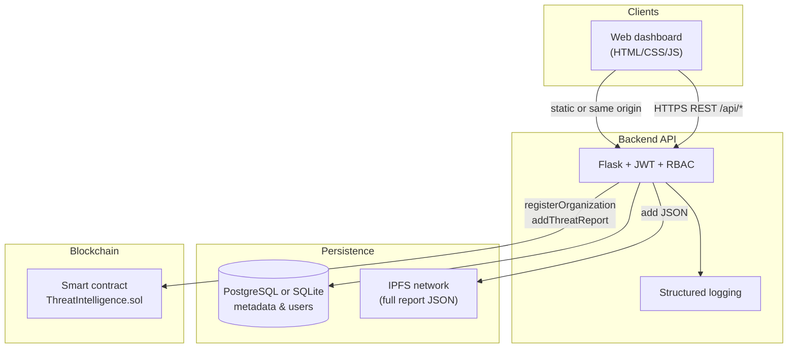

# System architecture

Educational prototype: **organizations** submit structured threat intelligence; the **backend** validates users, stores metadata in a **database**, uploads full JSON to **IPFS**, and anchors **Keccak256 hashes** plus IPFS CIDs on an **Ethereum-compatible** chain (Hardhat locally).

## High-level diagram

## Roles

| Role           | Capabilities                                                |
| -------------- | ----------------------------------------------------------- |
| **Admin**      | Bootstrap user; submits reports to DB (off-chain tx optional) |
| **Organization** | Registered org wallet; submits reports; hash + CID on-chain |
| **Analyst**    | Read-only: list threats, stats, verify hashes             |

## Data flow (submit)

1. User authenticates; JWT issued after password verification (hashed with Werkzeug).
2. Payload validated (lengths, allowed `attack_type` values).
3. Canonical JSON (sorted keys) → **Keccak256** → `report_hash`.
4. Same JSON → **IPFS** → `ipfs_hash` (CID).
5. Organization’s Ethereum key (stored encrypted at rest) signs **`addThreatReport(report_hash, ipfs_hash, organization)`**.
6. Row stored in DB with `report_hash`, `ipfs_hash`, optional `tx_hash`.

## Integrity (verify)

- **On-chain:** `verifyReport(bytes32)` returns whether that hash was stored.
- **Off-chain:** Optional comparison with DB row and future IPFS fetch by CID.

## Security notes (prototype)

- Use **HTTPS** in production (TLS at reverse proxy).
- Rotate **JWT_SECRET**, **SECRET_KEY**, and **ENCRYPTION_KEY**.
- Never commit real **ADMIN_PRIVATE_KEY** or user keys.
- IPFS content is **not** confidential by default; encrypt before upload if needed.
